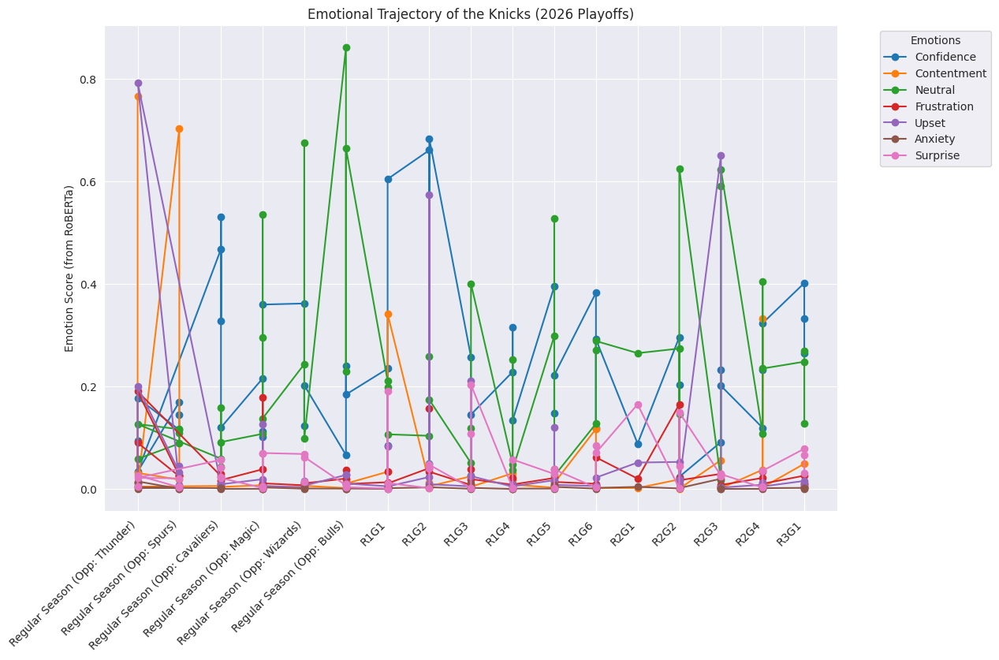

# 2026 NBA Finals NLP Prediction Pipeline

**Live Dashboard:** [[Click Here]](https://nba-finals-predictor-2026-izrjrrysjipdqjlrqbv5z7.streamlit.app/)

## The Question: Can we mathematically quantify a "Championship Mindset"?

I love basketball, and I’m obsessed with predicting who takes home the Larry O'Brien trophy. I’ve run the traditional statistical models—box scores, true shooting percentages, plus-minus ratings—but I wanted to build something different. Something that captures the *human* element. 

I built this Natural Language Processing (NLP) pipeline to branch out from traditional data science. I wanted to see if the emotional language used in post-game press conferences could reveal a team's psychological readiness to win a ring. 

## Sustainable & Lean Engineering
A massive priority for this build was architectural efficiency. Instead of brute-forcing transcripts through massive cloud APIs or energy-intensive LLMs, this pipeline runs entirely on sustainable, locally executed small-parameter models (like `roberta-base-go_emotions`). It is computationally lean, highly cost-effective, and proves you don't need a massive cloud cluster to run powerful NLP.

## Core Architecture
This operates on a 4-phase pipeline, transitioning unstructured audio/video data into a predictive probability matrix:

1. **Automated Ingestion:** Headless scraping of YouTube closed captions via `youtube-transcript-api`. *(Note: Overcoming channels that disable closed captions—specifically the San Antonio Spurs media team—required custom audio-extraction and localized whisper transcription patching).*
2. **Sentiment Extraction (NLP):** Processing text through a local Hugging Face transformer to generate 7-dimensional emotional feature vectors.
3. **Data Visualization:** Generation of chronological emotion-state trajectories using Seaborn and Matplotlib.
4. **Machine Learning Inference:** A Random Forest Classifier trained on historical 2024/2025 playoff data to identify "Championship Mindsets" and predict series winners.

## How to Repurpose This Pipeline
This architecture is sport and domain-agnostic. To repurpose this pipeline for the NFL, Premier League, or even political debates:
1. **Swap the Manifest:** Replace `2025-2026_playoff_vids.json` with a list of YouTube UUIDs relevant to your domain.
2. **Retrain the Model:** Provide a `raw_historical.csv` with known target variables (0 or 1) so the Random Forest can learn the specific emotional baseline of a "winner" in your chosen domain.
3. **Run `main.py`:** The pipeline will seamlessly ingest, score, and predict against your new historical baseline.
