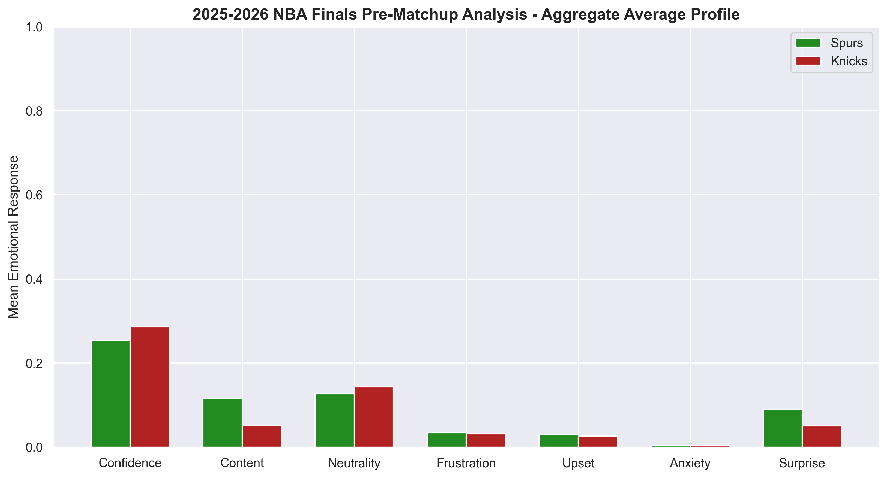

# 2026 NBA Finals NLP Predictor: Decoding Championship Psychology

**Live Dashboard:** [[Click Here]](https://nba-finals-predictor-2026-izrjrrysjipdqjlrqbv5z7.streamlit.app/)

## The Question: Can we mathematically quantify a "Championship Mindset"?

I love basketball, and I wanted to come up with something fun to do while I watched the Finals, seeing as the Bulls aren't in them. I’ve run the traditional statistical models—box scores, true shooting percentages, plus-minus ratings—but I wanted to build something different. Something that captures the *human* element. 

I built this Natural Language Processing (NLP) pipeline to branch out from traditional tabular data science. I wanted to see if the emotional language used in post-game press conferences could reveal a team's psychological readiness to win a ring. My goal was to discover whether steady linguistic composure (or sudden spikes in anxiety and frustration) can actually act as a lead indicator for tracking deep playoff runs.

## The Tech Stack & Architecture

To make this work, I had to build an end-to-end Python machine learning pipeline from scratch. Here is the logic behind the architecture:

* **Automated Data Ingestion & Fallback Patching:** The pipeline performs headless scraping of YouTube closed captions via `youtube-transcript-api`. However, I quickly realized some teams (like the San Antonio Spurs) disable auto-captions. To maintain data integrity, I engineered a fallback loop that extracts raw audio streams and runs them through a local Whisper transcription model to patch the missing text files.
* **Local NLP Sentiment Extraction (Green AI):** A massive priority for this build was architectural efficiency. Instead of brute-forcing transcripts through expensive, energy-intensive cloud APIs, this pipeline runs entirely on sustainable, locally executed small-parameter models (`roberta-base-go_emotions`). It extracts a 7-dimensional emotional feature vector (confidence, anxiety, frustration, etc.) on consumer hardware.
* **The Dual Ensemble Matrix:** I trained two separate Random Forest Regressors to evaluate the 2026 playoff bracket. The *Full Baseline Model* evaluates all available eras (2020-2025) to capture macro championship grit. I paired it with a *Targeted Modern Baseline* (2023-2025) to capture specific modern media dynamics. 
* **Tri-Tier Role Isolation:** Instead of averaging a whole team's sentiment together, the data is explicitly flattened into three isolated perspectives: Head Coaches, Franchise Stars, and Supporting Teammates. This prevents a calm coach from mathematically masking a panicked locker room.
* **Simulated Local RAG Engine:** To provide semantic accountability to the numbers, I built a local Retrieval-Augmented Generation (RAG) engine using ChromaDB and Sentence Transformers. The Streamlit dashboard simulates this local engine to provide raw quote verification without calling external cloud LLMs.

## Conclusions & Takeaways

Based on the final evaluations across both models, **the New York Knicks are projected to win the 2026 NBA Finals.** While the historical model predicts a grueling 7-game war, the modern era model projects a dominant 5-game finish. Across the data, Jalen Brunson and the Knicks' supporting roster maintained a much flatter, more stable emotional floor than the Spurs, effectively suppressing the anxiety spikes that normally plague road teams.

This project was a massive learning experience for me in a few key ways:
1. **Modular Python:** Moving data ingestion, model training, and the Streamlit front-end into their own isolated directories made the code infinitely easier to debug and scale.
2. **Handling Dirty Real-World Data:** Dealing with missing YouTube captions and overlapping broadcast audio on the SNY channel taught me how to write robust fallback functions instead of just letting the script crash.
3. **Sustainable Engineering:** I learned that you don't need a massive cloud computing cluster to do powerful NLP. By utilizing `chromadb`, local `sentence-transformers`, and targeted Hugging Face models, I built an enterprise-grade NLP pipeline that runs entirely locally.

## How to Use & Repurpose This Repo

This architecture is entirely domain-agnostic. You can easily clone this repo and run your own teams, politicians, or business leaders through the pipeline. 

1. **Clone the repository:** `git clone https://github.com/ishansinha5/nba-finals-sentiment-analysis-2026.git`
2. **Install the dependencies:** Run `pip install -r requirements.txt` in your virtual environment.
3. **Swap the Manifest:** Navigate to the `data/` folder and replace the target JSON files with a list of YouTube UUIDs relevant to your domain (e.g., NFL post-game interviews, political debates).
4. **Retrain the Baseline:** Provide a `raw_historical.csv` with known target variables (e.g., 0 for loser, 1 for winner) so the Random Forest can learn the specific emotional baseline of a "winner" in your chosen domain.
5. **Run the pipeline:** Execute the scraping modules in `scripts/`, then run the machine learning classifiers to generate your probability matrices!
6. **Test the RAG:** Run `python scripts/offline_rag_tester.py` locally to query your new database and find exact semantic matches from your transcripts.