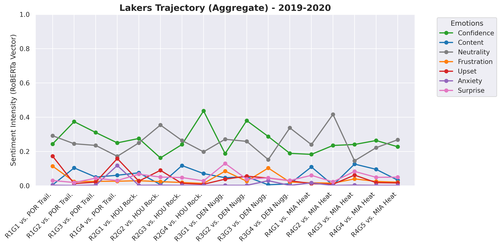
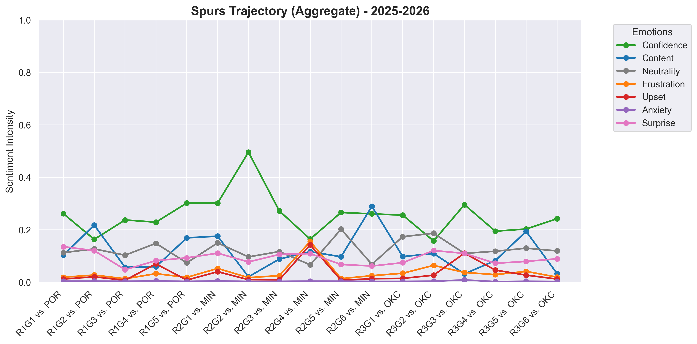

# Output Visualization Repository

This directory serves as the centralized storage for all generated analytical assets. Instead of cluttering the front-end application with dynamic image generation, we pre-compile these visualizations to ensure the Streamlit dashboard remains fast, lean, and highly responsive.

## Directory Structure

* **`historical/`**: Stores the aggregated sentiment trajectories for championship runs from 2019 through 2025. These visualizations serve as our "historical baseline," allowing us to compare the current 2026 playoff intensity against proven championship-caliber locker room profiles.

* **`live_2026/`**: Houses all 2026 postseason visualization assets. While this pipeline was originally architected to predict Conference Finals outcomes, it has since evolved into a deeper diagnostic tool. We now use these charts to map the structural emotional differences between Conference Champions, providing the necessary context to explain *why* teams enter the Finals with specific psychological advantages.

* **`predictions/`**: Contains the raw classifier output files and final probability matrices. This acts as the "ground truth" for the Finals Matchup prediction model, where we merge our historical and modern baseline scoring to synthesize the final 2026 series outcome.

## Why We Pre-Compile Visualizations
By decoupling visualization generation from the web-server runtime, we minimize server-side latency and avoid unnecessary re-computations. When a user requests a specific team analysis on the dashboard, the application simply references these pre-existing image paths, keeping the user experience seamless and zero-cost from a server-load perspective.